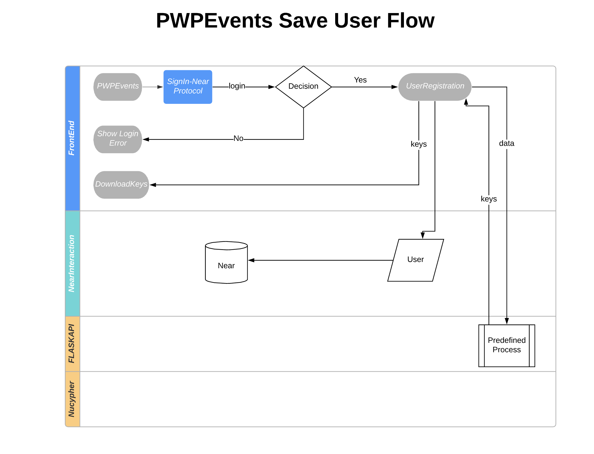
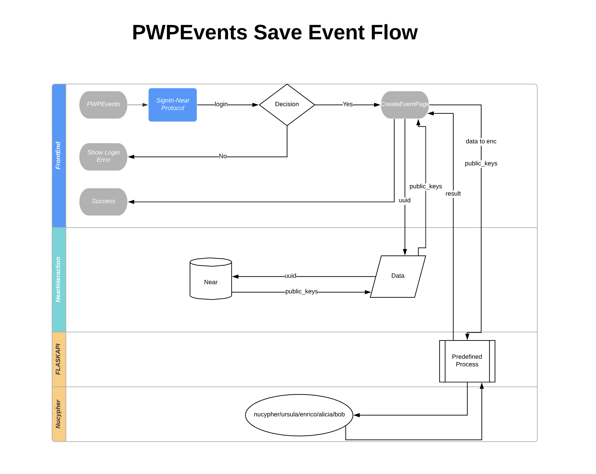
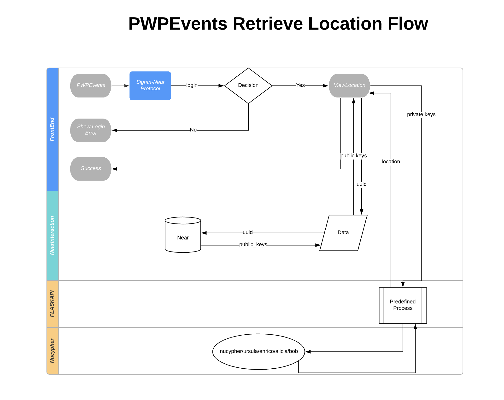

# PWPEvents

## Idea
Provide single platform for protest organizers to create events and allow others to join the event. 
## Why PWPEvents?
It's always a challenge for the protest organizers to track how many people are willing to participate in the protest.
There are several scenarios in which general public don’t feel the same way as protest organizers, that can lead to very less participation once protest starts at some specific location. 
PWPEvents will help protest organizers to test their protest purpose with general public. 
PWPEvents will also help organizers to view the number of subscriber to the event.
## What are we protecting?
We are protecting the events location or protest location. If people are really interested in the cause it doesn’t matter how far the event is happening people will try to reach the location if it is within certain range.
PWPEvents will ensure to show event locations only those who have subscribed to the event once a specified quorum is reached as specified by the organizer. 
## Tech Stack Under the Hood
### Near Protocol & Nucypher & Flask API & ReactJs
PWPEvents is using Near Protocol for user verification, smart contract and data persistent  
Nucypher to encrypt, store location data,  policy assignment and decrypting data  
Flask API to enable communication between React Web App and Nucypher node

## PWPEvents 50000 ft Bird Eye View

 

 

## Steps to get started with PWPEvents

 - Clone PWPEvents repository in the local machine 
 - Install [Python](%28https://docs.python-guide.org/starting/install3/osx/%29) in local machine
 - Install [pipenv](https://pipenv-fork.readthedocs.io/en/latest/install.html)
Once installation is completed it's time to create python virtual environment for flask api to start working
#### Follow these steps to activate virtual environment 
 - Activate virual environment by executing `pipenv shell` from the apiflask root folder
 - Once activation is done run `pip install -e .` from the root apiflask app
#### Configure Flask APP
 - It's time to export variables to make flask api up and running 
 - Run `export FLASK_APP=zkdonation.py`
 - Run `export FLASK_ENV=development`
 Before running flask app, make sure ursula is up and running at localhost port `10151`
 ### Setup Ursula 
 
 - Clone [nucypher](https://github.com/nucypher/nucypher) code repo 
 - Activate virtual environment from nucypher root folder
 - Run ursula by running `nucypher ursula run --dev --federated-only` 
 - If command fails then install nucypher by running `pip install nucypher`
 - Re-run step 3 command
 - Once command executed successfully ursula will be running on port `10151`
#### Run Flask App
 - Run flask app by running `flask run`
 - Flask API will start running on port `5000`
Once Flask API and Ursula starts running, it's time to run our UI
#### Run React App
 - Navigate to PWPEvents root folder
 - Open command line or terminal 
 - Run `yarn`
 - Run `buildui`
 - React app will start on localhost port `1234`

 ## Test it by yourself
 Note: Our server running cost is much so we have decided to run the server for the specific timings
 If you need server up ping either @rekpero#3898 or @prashantmaurya#6839
 [PWPEvents](pwpevents.centralus.cloudapp.azure.com) website
 
 ## Special Thanks
 IlliaAtNear and Mike Purvis for extending their helping hands when we ran into multiple NEAR protocol issue.
 Kprasch and maclane for making sure all active query resolution on the nucypher discord groups
 
 

